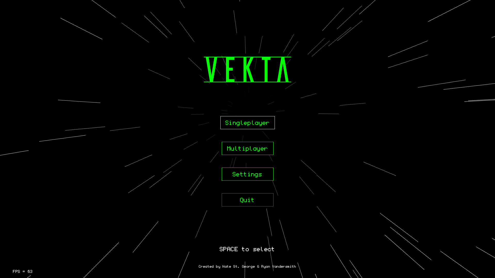

# VEKTA

## What is this?

VEKTA is an early-development space exploration game with an infinite universe to explore.

## Main Features

- Fully procedural star systems, planets, asteroids, and other celestial objects.
- Interactable transport ships, pirates, and space stations.
- NPCs with very intense personalities and complex background stories.
- Procedural missions, lore, and dialog.
- Modular ship customization and item crafting. 
- Visitable locations such as cities, shipyards, outposts, and hideouts.
- Colonization and city management.
- Mysterious dungeons, temples, and shipwrecks.
- Player-affected economies, real estate, and bond markets.
- Mining, data scanning, and ecological research.

## Code Styling

There is an [EditorConfig](https://editorconfig.org/) file provided in the root directory that will allow you automatically format your code as expected.
See [IntelliJ's documentation on EditorConfig files](https://www.jetbrains.com/help/idea/configuring-code-style.html#editorconfig) to see how it's used, or [install this addon for Eclipse](https://marketplace.eclipse.org/content/editorconfig-eclipse).

## Contributors

[Ryan Vandersmith](https://github.com/rvanasa)

[Nate St. George](https://github.com/nstgeorge)
